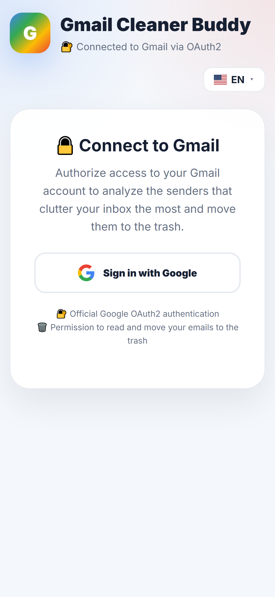
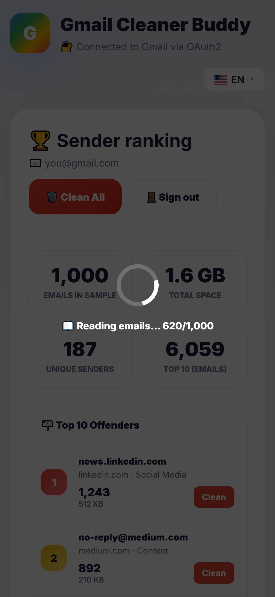
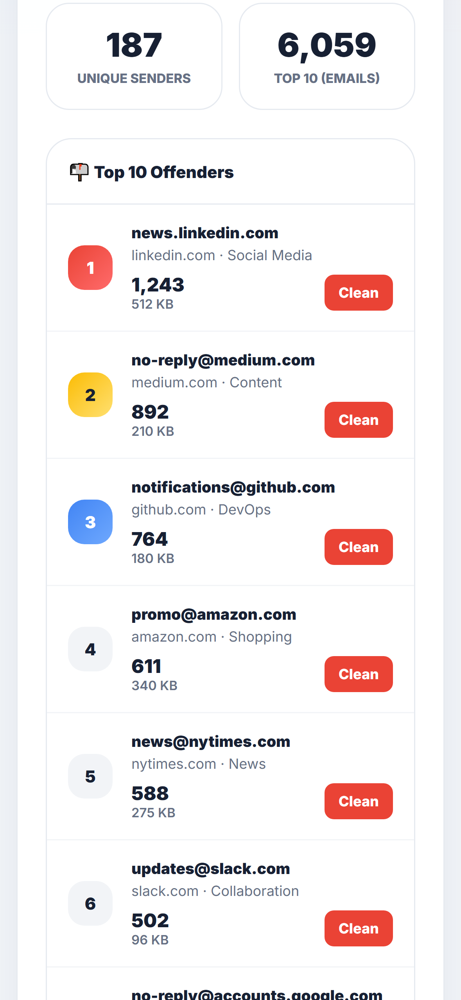

<h1 align="center">📱 Gmail Cleaner Buddy</h1>

  <em>Descubra quem mais lota a sua caixa do Gmail — e limpe com um toque.</em> 
  <em>Find out who floods your Gmail the most — and clean it out with one tap.</em>

  
  
  

  <a href="#pt">🇧🇷 Português</a> ·
  <a href="#en">🇺🇸 English</a> ·
  <a href="#es">🇪🇸 Español</a> ·
  <a href="#fr">🇫🇷 Français</a> ·
  <a href="#it">🇮🇹 Italiano</a> ·
  <a href="#ru">🇷🇺 Русский</a> ·
  <a href="#zh">🇨🇳 中文</a>

> 🛠️ **Como compilar, assinar e publicar:** [`INSTRUCTIONS.md`](INSTRUCTIONS.md)
> 🔒 **Política de privacidade:** https://mbastida43.github.io/gmailcleanerbuddy/privacy.html

---

## 🇧🇷 Português

App Android que encontra os remetentes que mais lotam a sua caixa de entrada do
Gmail e deixa você limpá-los com um toque. Cansado de milhares de newsletters,
promoções e notificações? O app analisa a sua conta, monta o ranking
**Top 10 Ofensores** — os endereços que mais enviam e-mails repetidos para você —
e move todos os e-mails deles para a lixeira de uma vez.

**Como funciona**
- Conecte sua conta com o login oficial do Google (OAuth2).
- O app analisa a sua caixa e conta com precisão quantos e-mails cada remetente enviou.
- Veja o Top 10 Ofensores, com categoria e volume.
- Toque para mandar todos os e-mails de um remetente para a lixeira — ou limpe o Top 10 de uma vez.

**Privacidade em primeiro lugar**
- Login oficial do Google — o app nunca vê a sua senha.
- Nenhuma credencial fica salva no aparelho: o acesso vive só na memória e expira em cerca de 1 hora.
- Os e-mails vão para a Lixeira do próprio Gmail (recuperáveis por 30 dias) — **nada é apagado permanentemente**.
- O app não lê o conteúdo das suas mensagens: só o endereço do remetente é usado para montar o ranking.
- Sem servidor próprio: o celular fala direto com a API do Gmail.

**Recursos**
- Top 10 Ofensores: os remetentes que mais lotam a sua caixa
- Contagem exata de e-mails por remetente
- Limpeza em massa com um toque
- Categorias automáticas (redes sociais, compras, notícias e mais)
- Interface em 7 idiomas

---

## 🇺🇸 English

An Android app that finds the senders flooding your Gmail inbox and lets you
clean them out with a single tap. Tired of thousands of newsletters, promotions
and notifications? The app scans your account, builds the **Top 10 Offenders**
ranking — the addresses that send you the most repeated emails — and moves all
of their emails to the trash at once.

**How it works**
- Connect your account with the official Google sign-in (OAuth2).
- The app scans your inbox and counts exactly how many emails each sender sent.
- See the Top 10 Offenders, with category and volume.
- Tap to send every email from a sender to the trash — or clean the whole Top 10 at once.

**Privacy first**
- Official Google sign-in — the app never sees your password.
- No credentials are stored on your device: access lives only in memory and expires in about 1 hour.
- Emails are moved to Gmail's own Trash (recoverable for 30 days) — **nothing is permanently deleted**.
- The app does not read the content of your messages: only the sender address is used to build the ranking.
- No backend of our own: the phone talks straight to the Gmail API.

**Features**
- Top 10 Offenders: the senders flooding your inbox
- Exact email count per sender
- One-tap bulk cleanup
- Automatic categories (social, shopping, news and more)
- Interface in 7 languages

---

## 🇪🇸 Español

Una app de Android que encuentra los remitentes que más llenan tu bandeja de
entrada de Gmail y te permite limpiarlos con un solo toque. ¿Cansado de miles de
boletines, promociones y notificaciones? La app analiza tu cuenta, arma el
ranking **Top 10 Infractores** —las direcciones que más correos repetidos te
envían— y mueve todos sus correos a la papelera de una vez.

**Cómo funciona**
- Conecta tu cuenta con el inicio de sesión oficial de Google (OAuth2).
- La app analiza tu bandeja y cuenta con precisión cuántos correos envió cada remitente.
- Mira el Top 10 Infractores, con categoría y volumen.
- Toca para enviar todos los correos de un remitente a la papelera, o limpia el Top 10 de una vez.

**La privacidad primero**
- Inicio de sesión oficial de Google: la app nunca ve tu contraseña.
- No se guardan credenciales en el dispositivo: el acceso vive solo en memoria y caduca en aproximadamente 1 hora.
- Los correos se mueven a la Papelera del propio Gmail (recuperables durante 30 días); **nada se elimina de forma permanente**.
- La app no lee el contenido de tus mensajes: solo se usa la dirección del remitente para armar el ranking.
- Sin servidor propio: el teléfono habla directamente con la API de Gmail.

**Funciones**
- Top 10 Infractores: los remitentes que más llenan tu bandeja
- Conteo exacto de correos por remitente
- Limpieza masiva con un toque
- Categorías automáticas (redes sociales, compras, noticias y más)
- Interfaz en 7 idiomas

---

## 🇫🇷 Français

Une appli Android qui identifie les expéditeurs qui encombrent le plus votre
boîte de réception Gmail et vous laisse les nettoyer d'un simple appui. Fatigué
de milliers de newsletters, promotions et notifications ? L'appli analyse votre
compte, établit le classement **Top 10 des Indésirables** — les adresses qui vous
envoient le plus d'e-mails répétés — et déplace tous leurs e-mails vers la
corbeille en une fois.

**Comment ça marche**
- Connectez votre compte avec la connexion officielle Google (OAuth2).
- L'appli analyse votre boîte et compte précisément combien d'e-mails chaque expéditeur a envoyés.
- Consultez le Top 10 des Indésirables, avec catégorie et volume.
- Appuyez pour envoyer tous les e-mails d'un expéditeur à la corbeille, ou nettoyez tout le Top 10 d'un coup.

**La confidentialité d'abord**
- Connexion officielle Google : l'appli ne voit jamais votre mot de passe.
- Aucun identifiant n'est stocké sur l'appareil : l'accès ne vit qu'en mémoire et expire au bout d'environ 1 heure.
- Les e-mails sont déplacés vers la Corbeille de Gmail (récupérables pendant 30 jours) ; **rien n'est supprimé définitivement**.
- L'appli ne lit pas le contenu de vos messages : seule l'adresse de l'expéditeur sert à établir le classement.
- Aucun serveur de notre côté : le téléphone parle directement à l'API Gmail.

**Fonctionnalités**
- Top 10 des Indésirables : les expéditeurs qui encombrent votre boîte
- Comptage exact des e-mails par expéditeur
- Nettoyage groupé en un appui
- Catégories automatiques (réseaux sociaux, achats, actualités et plus)
- Interface en 7 langues

---

## 🇮🇹 Italiano

Un'app Android che trova i mittenti che intasano di più la tua casella di posta
Gmail e ti permette di ripulirli con un solo tocco. Stanco di migliaia di
newsletter, promozioni e notifiche? L'app analizza il tuo account, crea la
classifica **Top 10 Responsabili** — gli indirizzi che ti inviano più email
ripetute — e sposta tutte le loro email nel cestino in una volta sola.

**Come funziona**
- Collega il tuo account con l'accesso ufficiale Google (OAuth2).
- L'app analizza la casella e conta con precisione quante email ha inviato ciascun mittente.
- Guarda il Top 10 Responsabili, con categoria e volume.
- Tocca per spostare nel cestino tutte le email di un mittente — o pulisci l'intero Top 10 in un colpo solo.

**La privacy al primo posto**
- Accesso ufficiale Google: l'app non vede mai la tua password.
- Nessuna credenziale viene salvata sul dispositivo: l'accesso vive solo in memoria e scade dopo circa 1 ora.
- Le email vengono spostate nel Cestino di Gmail (recuperabili per 30 giorni): **niente viene eliminato definitivamente**.
- L'app non legge il contenuto dei messaggi: per creare la classifica viene usato solo l'indirizzo del mittente.
- Nessun server nostro: il telefono parla direttamente con l'API di Gmail.

**Funzionalità**
- Top 10 Responsabili: i mittenti che intasano di più la casella
- Conteggio esatto delle email per mittente
- Pulizia in blocco con un tocco
- Categorie automatiche (social, acquisti, notizie e altro)
- Interfaccia in 7 lingue

---

## 🇷🇺 Русский

Android-приложение, которое находит отправителей, больше всего забивающих ваш
почтовый ящик Gmail, и позволяет очистить их одним касанием. Устали от тысяч
рассылок, промоакций и уведомлений? Приложение анализирует ваш аккаунт,
составляет рейтинг **«Топ-10 нарушителей»** — адреса, которые чаще всего
присылают вам повторяющиеся письма, — и разом перемещает все их письма в корзину.

**Как это работает**
- Подключите аккаунт через официальный вход Google (OAuth2).
- Приложение анализирует ящик и точно подсчитывает, сколько писем отправил каждый отправитель.
- Посмотрите Топ-10 нарушителей с категорией и объёмом.
- Коснитесь, чтобы отправить в корзину все письма одного отправителя — или весь Топ-10 сразу.

**Конфиденциальность прежде всего**
- Официальный вход Google — приложение никогда не видит ваш пароль.
- На устройстве не сохраняются учётные данные: доступ живёт только в памяти и истекает примерно через 1 час.
- Письма перемещаются в собственную Корзину Gmail (восстановимы 30 дней) — **ничего не удаляется навсегда**.
- Приложение не читает содержимое сообщений: для рейтинга используется только адрес отправителя.
- Никакого своего сервера: телефон обращается напрямую к API Gmail.

**Возможности**
- Топ-10 нарушителей: отправители, забивающие ваш ящик
- Точный подсчёт писем по каждому отправителю
- Массовая очистка одним касанием
- Автоматические категории (соцсети, покупки, новости и другое)
- Интерфейс на 7 языках

---

## 🇨🇳 中文

一款 Android 应用，找出最占用你 Gmail 收件箱的发件人，让你一键清理。厌倦了成千上万的
订阅邮件、促销和通知？应用会分析你的账号，生成**「前 10 名骚扰发件人」**排行榜——那些
反复给你发信最多的地址——并一次性把他们的所有邮件移入垃圾箱。

**工作原理**
- 使用官方 Google 登录（OAuth2）连接你的账号。
- 应用分析你的收件箱，精确统计每个发件人发送了多少封邮件。
- 查看前 10 名骚扰发件人，附带分类和容量。
- 轻点即可将某个发件人的全部邮件移入垃圾箱——或一次清理整个前 10 名。

**隐私优先**
- 官方 Google 登录——应用绝不会看到你的密码。
- 设备上不保存任何凭据：访问令牌只存在于内存中，约 1 小时后过期。
- 邮件会移入 Gmail 自己的垃圾箱（30 天内可恢复）——**不会永久删除任何内容**。
- 应用不会读取邮件内容：排行榜只使用发件人地址。
- 没有自建服务器：手机直接与 Gmail API 通信。

**功能**
- 前 10 名骚扰发件人：最占用你收件箱的发件人
- 按发件人精确统计邮件数量
- 一键批量清理
- 自动分类（社交媒体、购物、新闻等）
- 支持 7 种语言界面

---

## 🛠️ Tech stack

TypeScript · [Capacitor](https://capacitorjs.com/) · Gmail REST API ·
[`@capgo/capacitor-social-login`](https://github.com/Cap-go/capacitor-social-login)
(Credential Manager + Google Play Services Authorization API)

Web version: [mbastida43/gmailcleanerbuddy](https://github.com/mbastida43/gmailcleanerbuddy)

## License

This project is licensed under the MIT License — see the [LICENSE](LICENSE.md) file for details.
